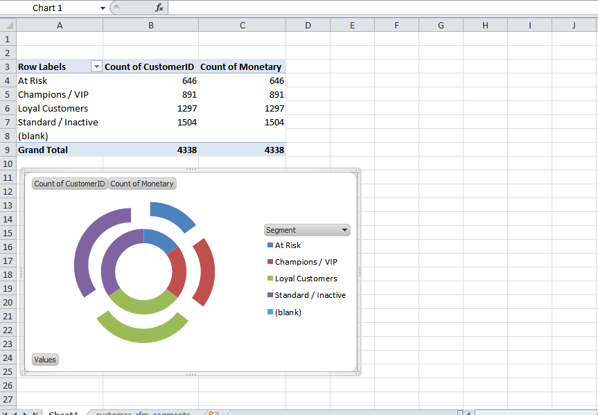

# E-Commerce Customer Segmentation & Revenue Analytics (RFM)

An end-to-end data analytics project using online retail transaction data to evaluate revenue trends, identify high-value customer segments, and mitigate churn risk.

## Dashboard Preview

## Tech Stack
* **Database & Querying:** SQL (CTEs, Window Functions, Views)
* **Data Processing & Analytics:** Python (`pandas`, `numpy`), Google Colab
* **Business Intelligence:** Microsoft Power BI / Excel

## Project Overview
1. **Data Cleaning:** Filtered cancelled transactions, negative/zero unit prices, and missing identifiers.
2. **RFM Modeling:** Evaluated customers across Recency (last order days), Frequency (order counts), and Monetary value (total spend).
3. **Cohort Segmentation:** Applied statistical quartile binning (1–4) to divide users into actionable cohorts:
   * **Champions / VIP:** High recency, high frequency, and high monetary spend.
   * **Loyal Customers:** Frequent buyers with consistent order patterns.
   * **At Risk:** High previous spenders who have not purchased in over 90 days.
   * **Standard / Inactive:** Low-frequency, low-engagement accounts.

## Repository Contents
* `rfm_analysis.sql` - SQL queries for data cleaning, CTE aggregations, and window-function quartile scoring.
* `rfm_analysis.py` - Python script for data extraction, automated quartile scoring, and segmentation export.
* `customer_rfm_segments.csv` - Final dataset containing RFM scores and assigned customer tiers.
* `dashboard_preview.png` - Visual executive dashboard summary.
